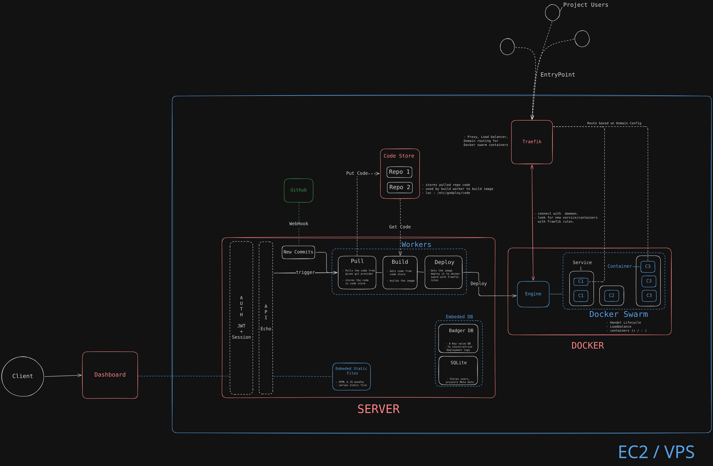

# Godploy

Lightweight, single-binary, self-hosted alternative to Dokploy, Coolify, Netlify, Vercel.

## Tech stack

- **Server:** Go
- **Runtime:** Docker
- **Ingress:** Traefik
- **DB:** SQLite (metadata)
- **UI:** sveltekit (SPA, served from binary)

## Architecture :

---

## Contribution guidelines

If you are instreasted in contributing or collaborating then connect with me in [twitter](https://twitter.com/r0shan_anand) / [Discord](https://discordapp.com/users/1114575128190271530) / [Email](https://mail.google.com/mail/u/0/?fs=1&to=roshan4nand@gmail.com&tf=cm)
